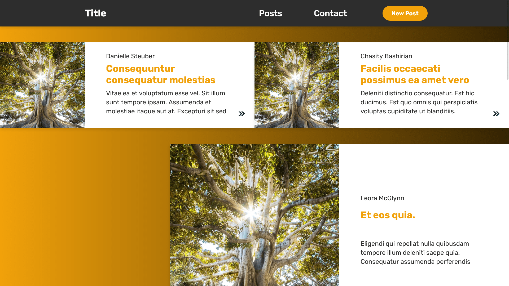

# Blog Frontend



[Live](https://jjnilton.github.io/projects/blog-frontend/out)

## Description

Blog frontend that displays a list of posts in a infinite scroll layout, and allow navigating to each post page.

* This project was originally made as an interview test, based on a Figma prototype, and depends on third-party APIs to work properly.

## Requirements

- [x] Infinite scroll page
- [x] Single page article
- [x] Contact modal
- [x] Responsive

## Build & Run

The project is built with the Next.js framework, so scripts to build and run are provided.

Build with:

```
npm run build
```

Run with:

```
npm run dev
```

The output will be in the `out` directory.

## Libraries Used

- Next.js
- React.js
- Styled Components
- DOMPurify

I decided to use React.js because it's what I'm focused on learning, so I'm more familiar with it, and it's a great tool to write UI. 

I started by thinking about each piece of the UI and which components I'd need to create. Though, after I completed it, I could see some improvements to the reusability and architecture in general.

For styling, I decided to use the Styled Components library. Besides being familiar with it, it helps handle dynamic styling based on the component state and supports SCSS syntax by default. 

Even then, some of the components ended up with too much CSS, so I'd try to fragment more on my next projects.

For the project starter, I decided to use the Next.js framework. It comes with a boilerplate with React.js and Styled Components. And since it's a blog-like project, it would allow using pages/routes and pre-rendering the content.

And to prevent XSS, I used DOMPurify since it's a popular, well-known, maintained library.
