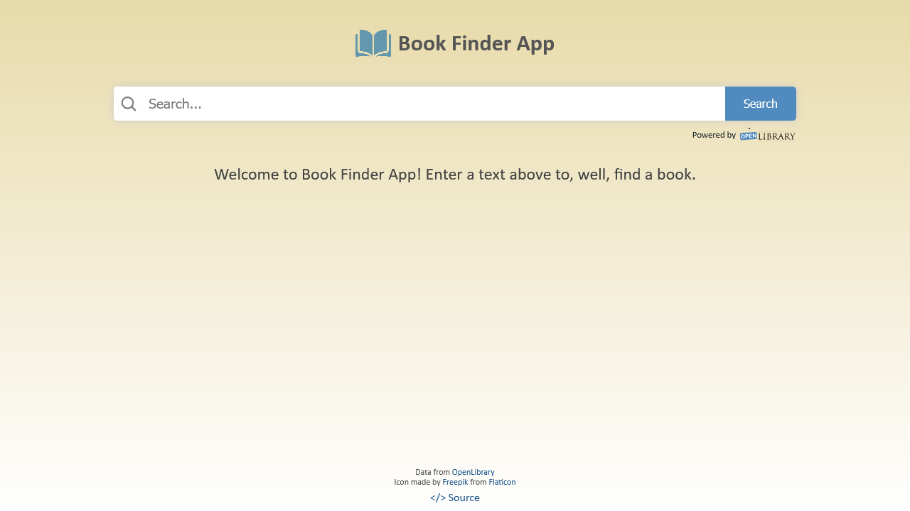

# Book Finder App

## Description

An application that will allow users to search for books by entering a query (Title, Author, etc), and displays the resulting books in a list on the page with all the corresponding data.

## Technologies

- Next.js
- Redux
- Styled Components
- React Testing Library
- OpenLibrary.org Web API
- Fakeimage.pl for image placeholders

## User Stories

- [x] User can enter a search query into an `input` field
- [x] User can submit the query. This will call an API that will return an array of books with the corresponding data (**Title**, **Author**, **Published Date**, **Picture**, etc)
- [x] User can see the list of books appearing on the page

## Bonus features

- [x] For each item in the list add a link that will send the User to an external site which has more information about the book
- [x] Implement a Responsive Design
- [x] Add loading animations

## Useful links and resources

[Book/library APIs](https://github.com/public-apis/public-apis#books)