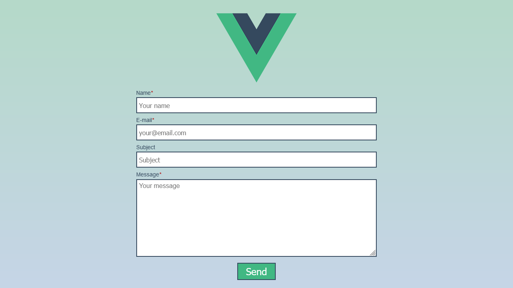

# Contact Form



[Live](https://jjnilton.github.io/projects/contact-form/dist)

## Description

A contact form that validate inputs and submit the data to API endpoint. 

## Project Setup

1. Rename `.env.sample` to `.env`, and add a valid API endpoint.

2. Install dependencies:

```
npm i
```

3. Run the development server

```
npm run serve
```

4. Run tests (optional)

```
npm run test:unit
```

## User Stories

- [x] Form should have elements for: name, email, subject, message, and a button to submit.
- [x] Name input should be between 5 and 50 characters, and is required.
- [x] E-mail input should validate an e-mail address, like: email@domain.com, and is required.
- [x] Subject is optional, and has a limit of 100 characters.
- [x] Message should have the maximum of 500 characters, and is required.
- [x] User should be able to clearly see which input is invalid, and get a message explaining if when it's invalid.
- [x] User can send the message after clicking the button to submit.
- [x] User must see the sending status and the result (error or success).
- [x] If there's any error, user's input should remain in form fields.

## Bonus features

- [x] Unit tests should be written for the main component.

## Useful links and resources

- [Regular Expressions](https://developer.mozilla.org/en-US/docs/Web/JavaScript/Guide/Regular_Expressions)
- [String.prototype.match](https://developer.mozilla.org/en-US/docs/Web/JavaScript/Reference/Global_Objects/String/match)
- [Fetch API](https://developer.mozilla.org/en-US/docs/Web/API/Fetch_API)
