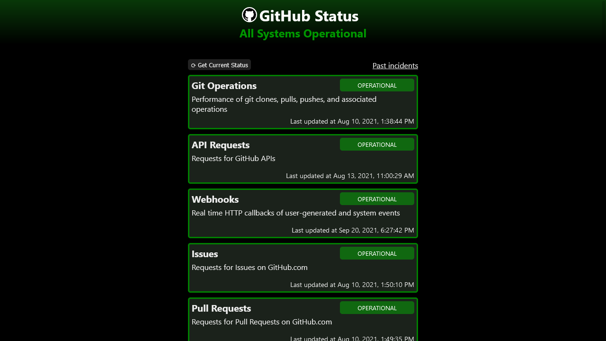

# GitHub Status

[Live](https://jjnilton.github.io/projects/github-status/build)

Retrieve the current GitHub site status from the [GitHub Status](https://www.githubstatus.com/) web site. 

## User Stories

- [x] User can see the current status for GitHub Git operations, API Requests,
      Operational Issues, PRs, Dashboard, & Projects, Operational Notifications,
      Operational Gists, and Operational GitHub Pages as a list in the main app
      window.
- [x] User can retrieve the most recent status from the GitHub Status web
      site by clicking a 'Get Status' button.

## Bonus features

- [x] User can see any of the GitHub components that are not in 'Operational'
      status highlighted by a different color, background animation, or any other
      technique to make it stand out.

## Useful links and resources

- [GitHub Status API](https://www.githubstatus.com/api)
- [Fetch API](https://developer.mozilla.org/en-US/docs/Web/API/Fetch_API)
- [Accept request HTTP header](https://developer.mozilla.org/en-US/docs/Web/HTTP/Headers/Accept)
- [Javascript JSON (MDN)](https://developer.mozilla.org/en-US/docs/Web/JavaScript/Reference/Global_Objects/JSON)
