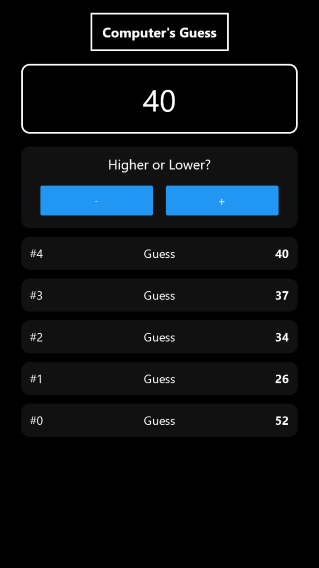

# To-Do App

|  |  |  |
|-----------------------------------------|-----------------------------------------|-----------------------------------------|

[Live](https://jjnilton.github.io/projects/guess-a-number-app/web-build)

## Description

An app where the user chooses a number, and the computer has to guess, with the user telling if the chosen number it's bigger or smaller.

## Tools

- React Native
- TypeScript
- Expo

## User Stories

- [x] User can enter a number to be guessed
- [x] User should see an error if the input is not valid
- [x] User should be able to tell if the chosen number is bigger or smaller
- [x] User should see an alert when giving the wrong tip (saying the number is bigger/smaller when it isn't)
- [x] User should see a list of previous attempts
- [x] User should see a game over screen with an image and a button to start over

## Bonus features

- [x] Use TypeScript

## Build & run instructions

This project is built with Create Expo App, so the scripts to build and run are provided.

Build with:

```
expo build:web
```

Run with:

```
expo start
```

