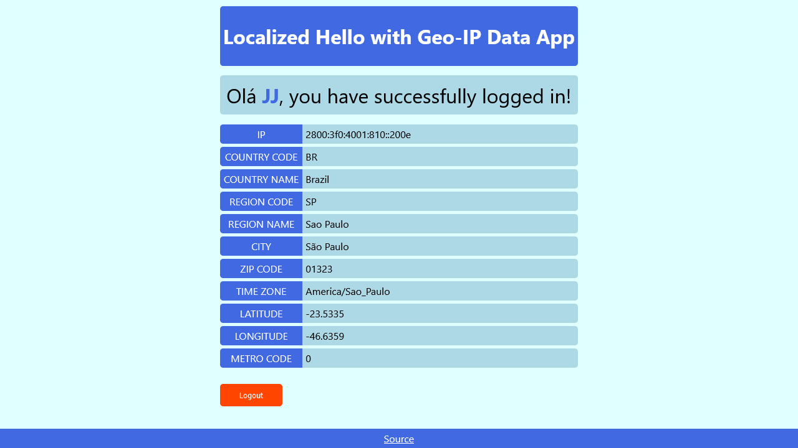

# Localized Hello with Geo-IP Data App

[Live](https://jjnilton.github.io/projects/localized-hello/build)

The objective of the Hello app is to leverage geo-location to obtain the users
country so it can then generate a customized greeting in the users native
language.

### Constraints

- Developers should use a geo-location API service to obtain the users IP.
- Developers should use the [Fourtonfish](https://www.fourtonfish.com/hellosalut/hello/) service to obtain the greeting in the users native language by passing the users IP.
- Developers must use a HTML entities decoding to decode the hello message.

## User Stories

- [x] User can see a mock login panel containing a user name text input field, a password text input field, and 'Login' and 'Logout' buttons.
- [x] User can enter a mock login name into the User Name field.
- [x] User can enter a mock password into the Password field. Input should be masked so the user see's asterisks (`*`) for each character that is entered rather than the plaintext password.
- [x] User can click the 'Login' button to perform a mock login.
- [x] User can see a message if either or both of the input fields are empty and the border color of the field(s) in error should be changed to red.
- [x] User can see a login acknowledgement message in the format: `<hello-in-native-language> <user-name> you have successfully logged in!`
- [x] User can click the 'Logout' button to clear the text input fields and any previous messages.
- [x] User can see a new message when successfully logged out in the format: `Have a great day <user-name>!`

## Bonus features

- [x] User can see an additional text input field for a language code which will be used to override the IP obtained through geo-location. Hint: this is a great feature for testing your app.
- [x] User can see additional geo-location information after logging on that includes at least the local IP address, city, region, country name, zip code, longitude, latitude, and timezone.

## Useful links and resources

- [Fourtonfish](https://www.fourtonfish.com/hellosalut/hello/)
- [Geo-location/IP API](https://stackoverflow.com/a/35123097)
