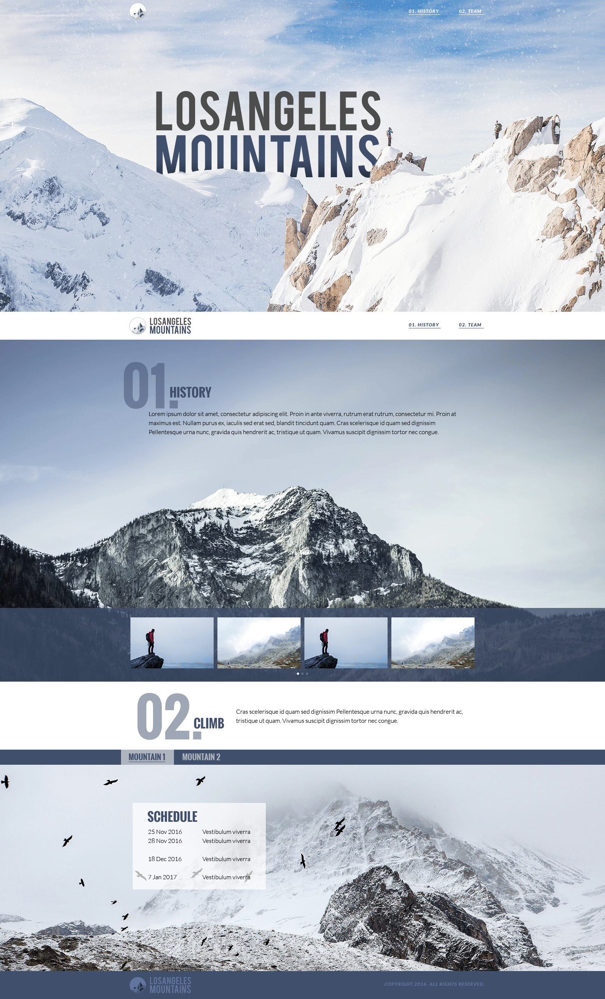

# Product Landing Page

[Link]()

## Description

A product landing page purely in HTML/CSS and vanilla JS.

Note: This project is based on a test the goal was to "translate" a layout from a PSD file [0] to a document using web technologies. The user stories are based on the instructions.

[PSD file](https://archive.org/details/ct-skill-test-v-3)

PSD screenshot

</img>

## Technologies & Tools

- HTML
- CSS
- JavaScript (Vanilla)
- GIMP, Photopea, and PSDTech to handle the PSD file, extracting images, and identifying fonts
- pngquant to reduce images' sizes

## User Stories

- [x] Convert the PSD to a HTML/CSS/JS website
- [x] Links should point to their respective sections
- [x] The website should be responsive
- [x] In the mobile view, the menu should be converted to an "accordion"

## Bonus Features

- [ ] Carousel should be functional
- [ ] Team sections tabs should be functional
- [ ] Resize extracted images to the appropriate proportion
