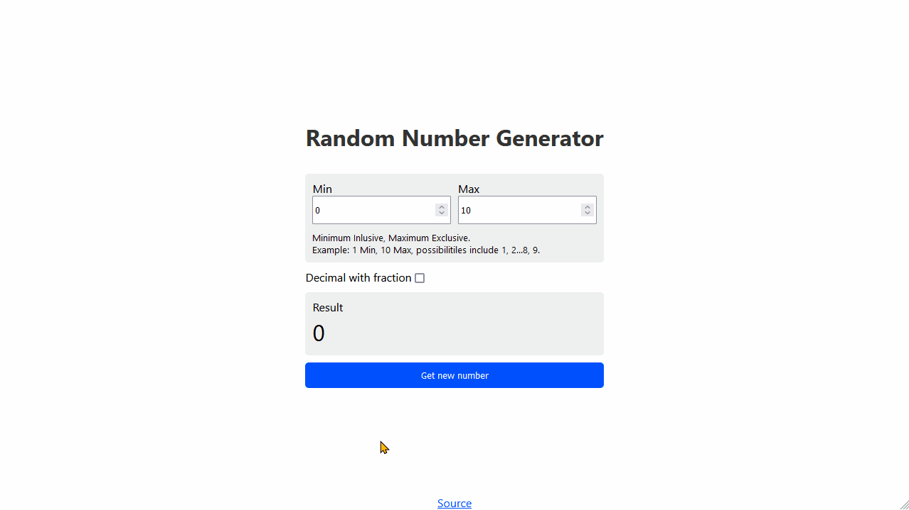

# Random Number Generator

[Live](https://jjnilton.github.io/projects/random-number-generator/build)

Generate a random number between a range of defined minimum and maximum.

The generator allows the user to use the random property for purposes like games that contains some kind of lottery or for statistics.

## User Stories

-   [x] User can define maximum and minimum values for the random number.
-   [x] User can press the generate button to generate random number.

## Bonus features

-   [x] User can add option for negative values
-   [x] User can add option for decimal numbers
