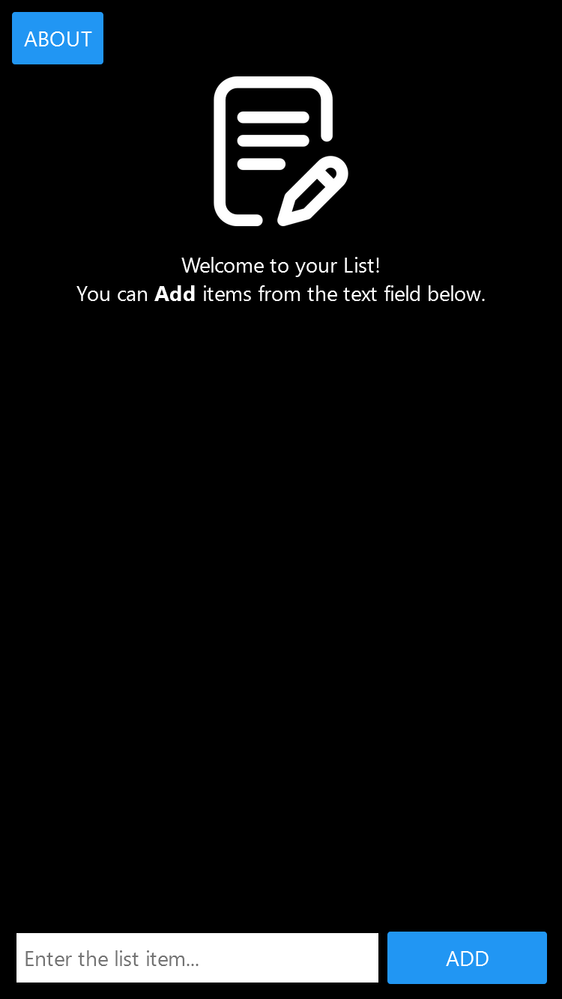
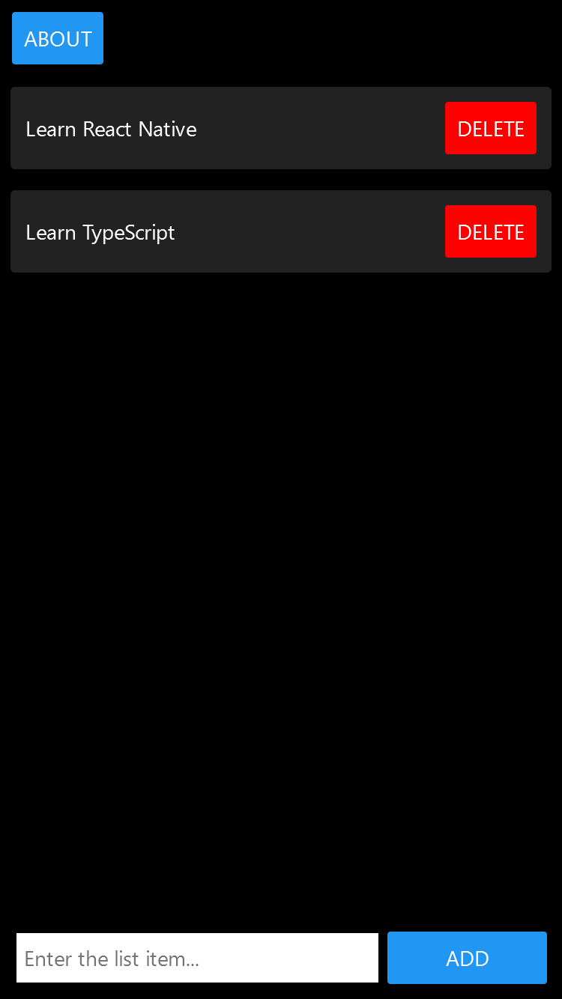

# To-Do App




[Live](https://jjnilton.github.io/projects/super-simple-list-app/web-build)

## Description

A super simple list app that allows adding and removing items.

## Tools

- React Native
- TypeScript
- Expo

## User Stories

- [x] User can see an input field where he can type in a to-do item
- [x] User can add an item by pressing a button
- [x] User can remove a to-do item by pressing a button
- [x] User can see a list of the items

## Bonus features

- [x] Use TypeScript

## Build & run instructions

This project is built with Create React App, so the scripts to build and run are provided.

Build with:

```
expo build:web
```

Run with:

```
expo start
```

