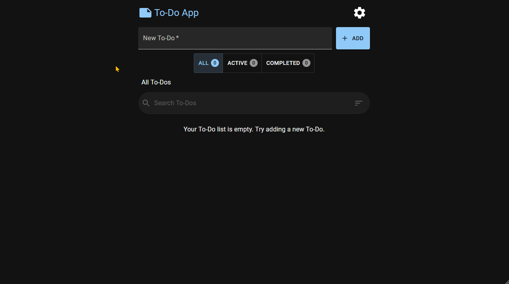

# To-Do App



[Live](https://jjnilton.github.io/projects/todo-app/build)

## Description

A simple To-Do list app that lets you manage to-dos, 

## Tools

- React.js
- TypeScript
- MUI
- CSS Modules (Sass/SCSS)
- ESLint
- React Testing Library (with Jest framework)

## User Stories

- [x] User can see an input field where he can type in a to-do item
- [x] By pressing enter (or a button), the User can submit the to-do item and can see that being added to a list of to-dos
- [x] User can mark a to-do as completed
- [x] User can remove a to-do item by pressing on a button (or on the to-do item itself)

## Bonus features

- [x] User can edit a to-do
- [x] User can see a list with all the completed to-dos
- [x] User can see a list with all the active to-dos
- [x] User can see the date when he created the to-do
- [x] When closing the browser window the to-do's will be stored and when the User returns, the data will be retrieved

## Extras

- [x] User can search the to-do list by typing part of the content
- [x] User can set a theme (dark mode)
- [x] User can sort the to-do list
- [x] User can set an option to delete without confirmation

## Build & run instructions

This project is built with Create React App, so the scripts to build and run are provided:

Build with:

```
npm run build
```

Run with:

```
npm start
```

Test with:

```
npm test
```

## Compatibility

Tested with:
- Node.js 16.13.1
- Mozilla Firefox 95.0.2
- Microsoft Edge 97.0.1072.55
