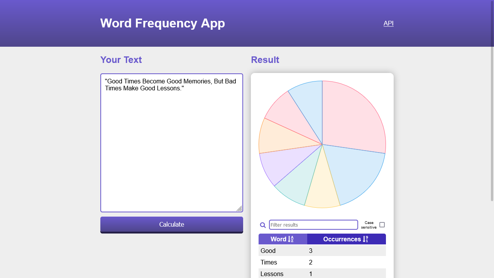

# Word Frequency

[Live](https://word-frequency-app.vercel.app/)

## Description

Displays the frequency of words in a
block of text and create a tabular display of each unique word in the text
along with its frequency.

## User Stories

- [x] User can see a text input box, a button, and a word
      frequency table.
- [x] User can enter text into the input box. This input
      box must allow the entry of large blocks of text.
- [x] User can click the button to analyze the word frequency in
      the text that has been input.
- [ ] User can see an error message if the text input box is empty.
- [x] User can see the word frequency table populated when the button is clicked. Each row in the table contains a word and the number of times
      it occurs in the input text.
- [x] User can see the word frequency table ordered in descending sequence
      by word frequency.

## Bonus features

- [x] User can see a graphical representation of the word frequency in a
      bubble chart, column chart, or any other form of graphical representation the
      developer chooses.
- [ ] User may choose to enter the URL of a web page whose content is to be
      analyzed instead of manually entering text.

## Extras

- [x] User can sort the table data by clicking on it's header.
- [x] User can filter the words by typing in a input field.
- [x] User can access the core functionality from an API endpoint.

## Useful links and resources

- [Bag of Words Model (Wikipedia)](https://en.wikipedia.org/wiki/Bag-of-words_model)
- [Semantic Analysis (Wikipedia)](https://en.wikipedia.org/wiki/Sentiment_analysis)
